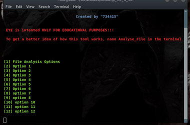
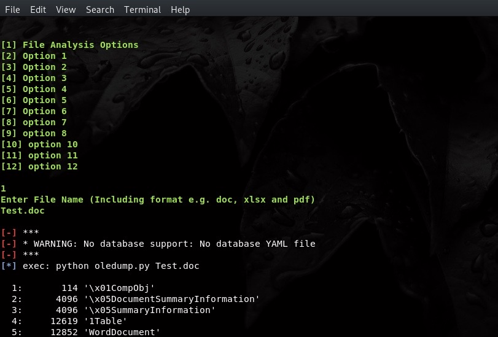
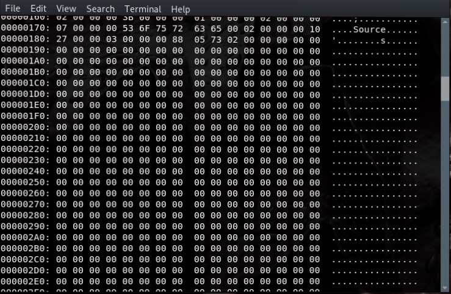

# Automated-File-Binary-Analysis
The aim of this repository is to automate the anaysis of file's binary using the oledump project.

Read more about the Oledump Project: https://blog.didierstevens.com/2014/12/17/introducing-oledump-py/

# Requirement:
<li> Kali Linux (os) </li>
<li> Python </li>

# Usage

Step 1: Bash Analyse_File

Step 2: Eye's Menu

Step 3

